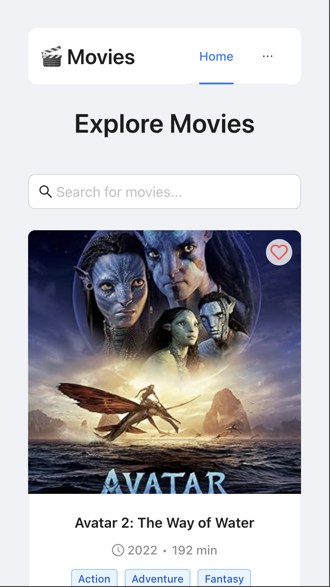
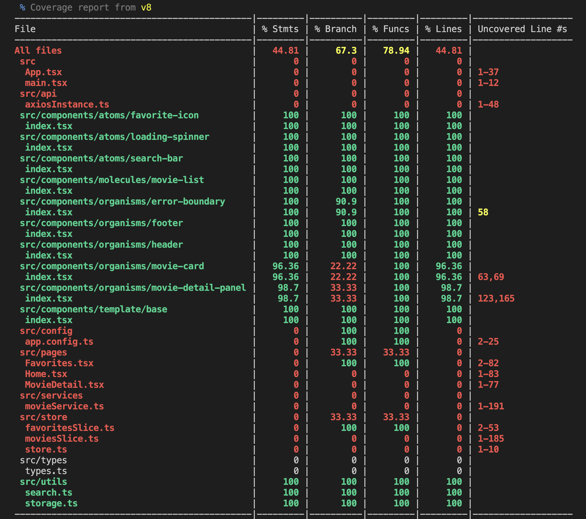

# 🎬 Movie App

A responsive, movie-browsing SPA built with React, TypeScript, Vite, Ant Design, and SCSS.

## Features

- Browse movie listings with details
- Search for movies by title
- View detailed information about each movie
- Add/remove movies to favorites (persisted in localStorage)
- Responsive design for all devices
- Error boundary for graceful error handling
- Comprehensive test coverage

## Tech Stack

- **Framework:** React + TypeScript (via Vite)
- **UI Library:** Ant Design components (Grid, Card, Input, Button, Layout)
- **Styling:** SCSS with BEM methodology
- **HTTP Client:** Axios with request/response interceptors for:
  - Content-Type: application/json
  - JWT Auth with token from localStorage
  - Global error handling
  - API response caching
- **State Management:** Redux Toolkit for centralized state
  - Movies slice with async thunks for data fetching
  - Favorites slice synced with localStorage
- **Routing:** React Router for navigation
- **Icons:** React-Icons for heart/favorite toggles
- **Storage:** LocalStorage for favorites persistence
- **Testing:** Vitest with React Testing Library
- **Code Quality:** ESLint + Prettier

## Getting Started

### Prerequisites

- Node.js (v22.14.0 or later)
- npm (v10.8.2 or later)

### Installation

```bash
# Clone the repository
git clone https://github.com/wakidurrahman/movie-based-application.git


# Install dependencies
npm install
```

### Development

```bash
# Start the development server
npm run dev
```

This will start the development server at `http://localhost:5173`.

### Scripts

```bash
# Start development server
npm run dev

# Build for production
npm run build

# Preview the production build
npm run preview

# Run tests
npm run test

# Run tests in watch mode
npm run test:watch

# Run tests with coverage
npm run test:coverage

# Format code
npm run format

# Check formatting
npm run format:check

# Lint code
npm run lint

# Run all CI checks locally
npm run ci
```

## Environment Configuration

The application supports different environments through the `app.config.ts` file:

- **Development Mode:**

  - Uses local sample data from `src/data/sample.json`
  - No API calls to external services
  - Simplified development workflow
  - No rate limiting concerns
  - Local caching through Redux store only

- **Production Mode:**
  - Connects to OMDB API
  - Uses API key for authentication
  - Implements proper error handling
  - Implements API rate limiting strategy
  - Enhanced caching strategy with localStorage persistence

### Environment Variables

The application requires the following environment variables:

```
# OMDB API Key (required for production)
VITE_OMDB_API_KEY=your_api_key_here

# API Base URL
VITE_API_BASE_URL=https://www.omdbapi.com

# Environment mode (development | production)
MODE=development
```

A sample `.env.example` file is included in the repository. Copy this file to `.env.local` and add your API key to get started:

```bash
# Copy the example environment file
cp .env.example .env.local

# Edit the file to add your API key
nano .env.local
```

The environment is automatically detected based on the `MODE` environment variable, and can be explicitly set when running scripts:

```bash
# Run in development mode
npm run dev

# Build for production
npm run build

# Run preview
npm run preview
```

## Project Structure

The project follows an atomic `design pattern` with a component-focused folder structure:

```bash
src/
├─ api/
│  └─ axiosInstance.ts           # Centralized Axios instance with interceptors
├─ assets/                       # Static assets
├─ components/
│  ├─ atoms/                     # Basic building blocks
│  │  ├─ favorite-icon/          # Toggleable heart icon component
│  │  │  ├─ index.tsx
│  │  │  └─ index.scss
│  │  ├─ loading-spinner/        # Loading indicator component
│  │  │  ├─ index.tsx
│  │  │  └─ index.scss
│  │  └─ search-bar/             # Debounced search input component
│  │     ├─ index.tsx
│  │     └─ index.scss
│  ├─ molecules/                 # Combinations of atoms
│  │  └─ movie-list/             # Grid of movie cards
│  │     ├─ index.tsx
│  │     └─ index.scss
│  ├─ organisms/                 # Complex components
│  │  ├─ error-boundary/         # Error handling component
│  │  │  ├─ index.tsx
│  │  │  └─ index.scss
│  │  ├─ footer/                 # App footer component
│  │  │  ├─ index.tsx
│  │  │  └─ index.scss
│  │  ├─ header/                 # App header with navigation
│  │  │  ├─ index.tsx
│  │  │  └─ index.scss
│  │  ├─ movie-card/             # Individual movie card
│  │  │  ├─ index.tsx
│  │  │  ├─ index.test.tsx
│  │  │  └─ index.scss
│  │  └─ movie-detail-panel/     # Detailed movie view
│  │     ├─ index.tsx
│  │     └─ index.scss
│  └─ template/                  # Page layouts
│     └─ base/                   # Base page layout template
│        ├─ index.tsx
│        └─ index.scss
├─ config/
│  └─ app.config.ts              # Environment configuration
├─ data/
│  └─ sample.json                 # Sample movie data for development
├─ pages/
│  ├─ Home.tsx                   # Main movie listing page
│  ├─ Favorites.tsx              # User's favorite movies
│  └─ MovieDetail.tsx            # Individual movie details
├─ services/
│  └─ movieService.ts            # Movie API service with caching
├─ store/
│  ├─ moviesSlice.ts             # Redux slice for movies
│  ├─ favoritesSlice.ts          # Redux slice for favorites
│  └─ store.ts                   # Redux store configuration
├─ utils/
│  └─ storage.ts                 # LocalStorage utilities
├─ test/
│  └─ setup.ts                   # Vitest setup and mocks
├─ App.tsx                       # Main application component
├─ main.tsx                      # Application entry point
├─ App.scss                      # Global application styles
└─ index.scss                    # Base styles and resets
```

## BEM Methodology

The project uses BEM (Block, Element, Modifier) methodology for CSS with SCSS:

- **Blocks:** Component types are prefixed:

  - `a-` for atoms (e.g., `a-favorite-icon`)
  - `m-` for molecules (e.g., `m-movie-list`)
  - `o-` for organisms (e.g., `o-movie-card`)
  - `t-` for templates (e.g., `t-base`)

- **Elements:** Denoted by double underscores

  - `.a-favorite-icon__button`
  - `.m-movie-list__row`

- **Modifiers:** Denoted by double hyphens
  - `.o-loading-spinner--fullscreen`

## Application Flow

1. **Data Fetching:** The app fetches movie data from:

   - Development mode: Local `sample.json` file
   - Production mode: OMDB API via axios

2. **Home Page:**

   - Shows a list of movie cards with essential information
   - Displays a loading spinner during data fetching
   - Provides search functionality with debounced filtering
   - Allows toggling favorites

3. **Movie Details:**

   - Accessed by clicking on a movie card
   - Loads data from Redux or fetches if missing
   - Shows comprehensive movie information
   - Includes a back to home button
   - Maintains favorite toggle functionality

4. **Favorites Page:**
   - Displays only user's favorited movies
   - Provides search within favorites
   - Shows empty state when no favorites exist
   - Maintains favorite toggle functionality

## Data Management

- **Redux Store:** Centralized state management
  - Movies slice stores all movie data
  - Favorites slice tracks user's favorite movie IDs
- **Async Operations:** Redux Toolkit's `createAsyncThunk` for data fetching
- **Persistence:** Favorites synced with localStorage through utility functions
- **API Communication:** Axios instance with interceptors for authentication and error handling
- **Caching:** API responses are cached to prevent duplicate requests
  - In-memory caching for session
  - LocalStorage persistence for longer-term caching
  - TTL (Time-to-Live) based invalidation
  - Manual cache clearing on specific actions

## Testing Strategy

The project employs a comprehensive testing approach:

### Unit Testing

- Individual component testing with React Testing Library
- Redux slice and action creators testing
- Utility function testing
- Target coverage: 80% minimum for critical paths

### Mock Strategy

- For development mode, I mocked the API responses using `sample.json` file
- LocalStorage mocked with a custom implementation
- Redux store mocked for isolated component testing
- Time-based functions (setTimeout, etc.) mocked for deterministic testing

### Test Coverage Thresholds

This my target coverage thresholds.

```json
{
  "statements": 80,
  "branches": 70,
  "functions": 80,
  "lines": 80
}
```

Current test coverage is not maintained above these thresholds and visually represented in the coverage report.

## Performance Optimization

The application implements several performance optimization strategies:

### Code Splitting

- Route-based code splitting with React.lazy and Suspense(for small project id could not apply for now)
- Component-level dynamic imports for heavy components
- Vendor chunk splitting in Vite configuration
- Cache-busting: Including content hashes in filenames so updates invalidate old cache

### Rendering Optimization

- React.memo for pure functional components
- useMemo and useCallback hooks for expensive calculations
- Debounced search input to prevent excessive re-renders

### Network Optimization

- API response caching
- Conditional fetching based on data freshness
- Compressed assets via Vite build optimization

### Metrics

Performance is measured using Lighthouse scores targeting:

- First Contentful Paint: < 1.8s
- Largest Contentful Paint: < 2.5s
- Time to Interactive: < 3.5s
- Total Blocking Time: < 200ms
- Cumulative Layout Shift: < 0.1

## Accessibility (A11y)

The application is built with accessibility in mind:

- Semantic HTML structure throughout
- Proper heading hierarchy
- ARIA attributes where necessary
- Keyboard navigation support
- Focus management for modals and dialogs
- Screen reader friendly content
- Support for reduced motion preferences

## Browser Compatibility

The application is tested and supported on the following browsers:

- Chrome (latest 2 versions)
- Firefox (latest 2 versions)
- Safari (latest 2 versions)
- Edge (latest 2 versions)
- iOS Safari (latest 2 versions)
- Android Chrome (latest 2 versions)

Polyfills are automatically included for older browsers via Vite's default configuration with `@vitejs/plugin-react`.

## Security Considerations

The application implements security best practices:

- API key stored in environment variables, never in client code
- Content Security Policy (CSP) headers
- HTTPS enforcement
- Input sanitization for search queries
- No sensitive data stored in localStorage
- Regular dependency updates to patch vulnerabilities
- Security headers configured in deployment

## Development Tools

- **VS Code Configuration:** Optimized settings for development
  - Format on save with Prettier
  - ESLint integration
  - Debug configurations
- **Code Quality:**
  - ESLint with TypeScript and React plugins
  - Prettier for consistent formatting
  - TypeScript for type safety
  - StyleLint for SCSS linting with BEM validation
- **Testing:**
  - Vitest configuration
  - React Testing Library for component tests
  - Mock implementations for external dependencies
  - Coverage reporting

## DevOps & Deployment

### CI/CD Pipeline

The project uses GitHub Actions for CI/CD:

#### CI Workflow Detail

The CI pipeline, defined in `.github/workflows/ci.yml`, runs the following checks:

```yml
name: CI

on:
  push:
    branches: [main]
  pull_request:
    branches: [main]

jobs:
  build:
    runs-on: ubuntu-latest

    steps:
      - uses: actions/checkout@v3
      - name: Setup Node.js
        uses: actions/setup-node@v3
        with:
          node-version: [22.x]
          cache: 'npm'
      - name: Install dependencies
        run: npm ci
      - name: Lint code
        run: npm run lint
      - name: Check formatting
        run: npm run format:check
      - name: Run tests with coverage
        run: npm run test:coverage
      - name: Build
        run: npm run build
      - name: Upload coverage reports
        uses: codecov/codecov-action@v3
```

## Dev output

- PC view


- Mobile view



- Code coverage



## Continuous Integration Setup

This project uses GitHub Actions for continuous integration. The CI workflow automatically runs on pushes to the main branch and pull requests targeting the main branch.

### CI Workflow

The CI workflow performs the following checks:

1. **Linting**: Ensures code follows the project's ESLint rules
2. **Formatting**: Verifies code is formatted according to Prettier rules
3. **Testing**: Runs all tests to ensure functionality
4. **Building**: Verifies the project builds successfully

## Workflow Configuration

The workflow is configured in `.github/workflows/ci.yml` and uses Node.js version 22.14.0, which is the required version for this project.

## Running Locally

You can run the same checks locally using the CI script:

```bash
# Run all CI checks
npm run ci
```

## License

This project is licensed under the MIT License.

---

## Version History

- v1.0.0 - Initial release
- v1.1.0 - Added favorites functionality
